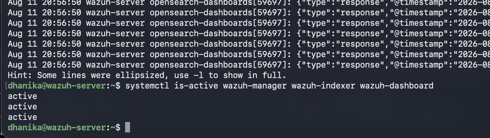
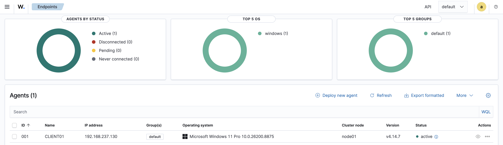
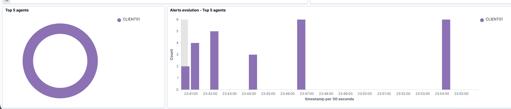

# Project 01 – Wazuh Infrastructure & Windows Agent Deployment

## Overview

This project establishes the infrastructure for an enterprise-style Wazuh SOC home lab.

A single-node Wazuh deployment was built on an Ubuntu Server ARM64 virtual machine running on an Apple Silicon host. A Windows 11 ARM endpoint was then onboarded as a monitored Wazuh agent.

The deployment was validated by confirming the health of the Wazuh services, successful endpoint enrollment, and ingestion of Windows security telemetry.

## Lab Architecture

```text
Apple Silicon M4 MacBook
│
├── Ubuntu Server 24.04 ARM64
│   │
│   ├── Wazuh Manager
│   ├── Wazuh Indexer
│   └── Wazuh Dashboard
│
└── Windows 11 ARM
    │
    └── CLIENT01
         └── Wazuh Agent
               │
               │ Security Telemetry
               ▼
          Wazuh Server
```

## Technologies

- Wazuh
- Ubuntu Server 24.04 ARM64
- Windows 11 ARM
- VMware Fusion
- SSH
- Linux systemd
- Wazuh Agent

## 1. Wazuh Infrastructure Deployment

The Wazuh server was deployed as an all-in-one installation containing:

```text
Wazuh Manager
Wazuh Indexer
Wazuh Dashboard
```

The Ubuntu server was configured with sufficient storage for security-event indexing and analysis.

Service health was validated using:

```bash
systemctl is-active wazuh-manager wazuh-indexer wazuh-dashboard
```

All three components returned:

```text
active
active
active
```



## 2. Windows Endpoint Enrollment

The Windows 11 endpoint was enrolled into Wazuh as:

```text
CLIENT01
```

The Wazuh agent service was verified on Windows and the endpoint successfully established communication with the Wazuh manager.

The dashboard reported the agent as:

```text
Status: Active
```



## 3. Telemetry Validation

After successful enrollment, Windows telemetry was searched from the Wazuh dashboard.

The initial validation returned:

```text
21 events
```

associated with `CLIENT01`.



This confirmed the complete telemetry path:

```text
Windows 11
    ↓
Wazuh Agent
    ↓
Wazuh Manager
    ↓
Wazuh Indexer
    ↓
Wazuh Dashboard
    ↓
SOC Analyst
```

## Validation Results

| Component | Result |
|---|---|
| Wazuh Manager | Active |
| Wazuh Indexer | Active |
| Wazuh Dashboard | Active |
| CLIENT01 Agent | Active |
| Windows Telemetry | Successfully received |
| Initial Events Observed | 21 |

## Outcome

A functioning Wazuh security-monitoring environment was successfully established.

The Windows endpoint is actively communicating with the Wazuh server and producing searchable security telemetry.

This infrastructure provides the foundation for subsequent projects involving Sysmon telemetry, attack detection, file integrity monitoring, vulnerability management, custom detection engineering, threat hunting, and automated response.

## Skills Demonstrated

- Wazuh deployment
- SIEM/XDR infrastructure
- Linux server administration
- Windows endpoint onboarding
- Agent management
- Security telemetry ingestion
- Service validation
- ARM64 virtualization
- SOC lab architecture
- Basic troubleshooting