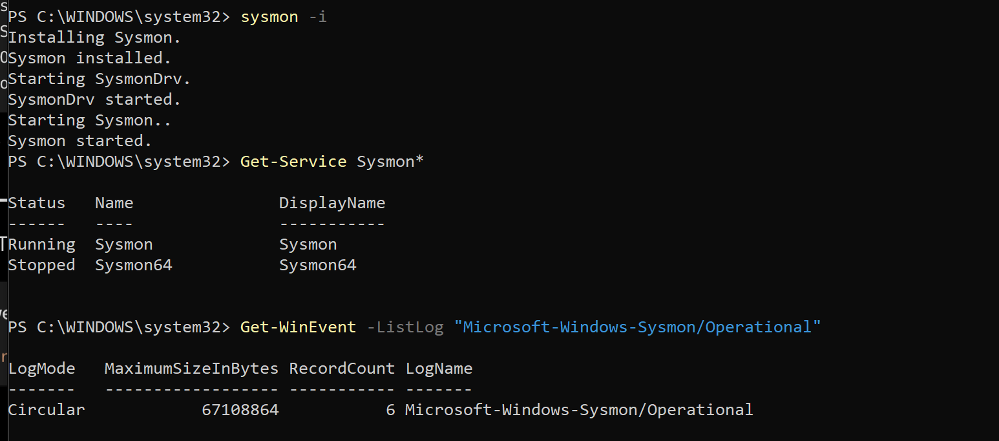
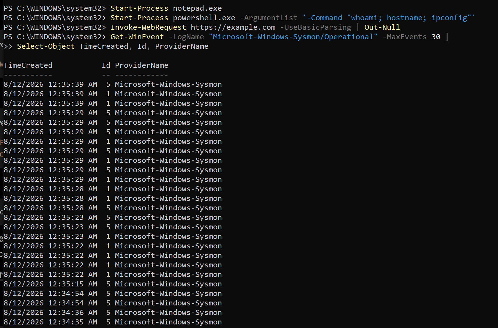
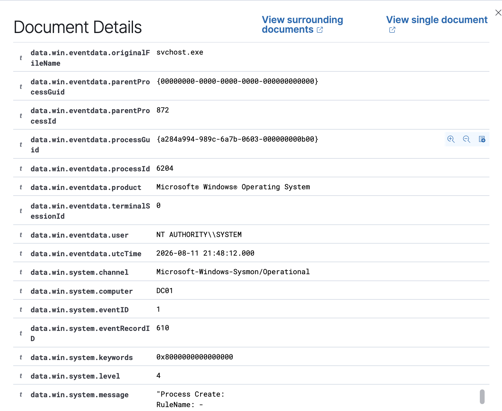
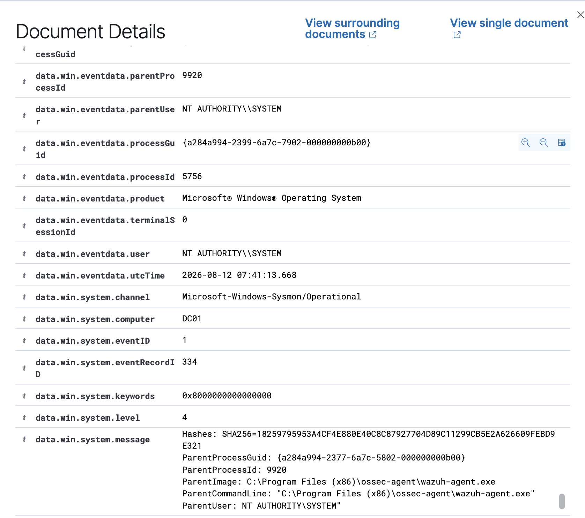

# Project 02 – Windows & Sysmon Endpoint Monitoring

## Overview

This project integrates native Sysmon telemetry from a Windows 11 ARM endpoint with Wazuh for endpoint monitoring and threat hunting.

The lab demonstrates process telemetry collection, centralized SIEM ingestion, and investigation of PowerShell activity.

## Architecture

```text
Windows 11 ARM (CLIENT01)
        ↓
Native Sysmon
        ↓
Sysmon Operational Log
        ↓
Wazuh Agent
        ↓
Wazuh Manager / Indexer
        ↓
Threat Hunting
```

## Implementation

Native Windows Sysmon was enabled and configured on `CLIENT01`.

Sysmon successfully generated endpoint telemetry including:

- Event ID 1 – Process Creation
- Event ID 5 – Process Termination

The Wazuh agent was configured to collect:

```text
Microsoft-Windows-Sysmon/Operational
```

and forward the events to the Wazuh server.

## Threat Hunting

Test activity was generated using PowerShell:

```powershell
Start-Process powershell.exe -ArgumentList '-Command "whoami; hostname"'
```

Wazuh successfully detected the resulting process creation activity.

Threat Hunting showed Sysmon process events from `CLIENT01`, including Wazuh rule:

```text
67027 – A process was created.
```

The PowerShell event was then investigated to review process and command-line information.

## Evidence

### Native Sysmon



### Sysmon Event Generation



### Wazuh Ingestion



### Process Investigation



## Outcome

Sysmon endpoint telemetry was successfully collected from Windows 11 ARM and ingested into Wazuh. Process creation activity could then be identified and investigated through Wazuh Threat Hunting.

## Skills Demonstrated

- Wazuh
- Sysmon
- Windows endpoint monitoring
- SIEM log ingestion
- PowerShell telemetry
- Process analysis
- Threat hunting