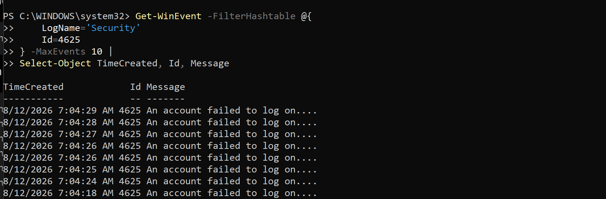
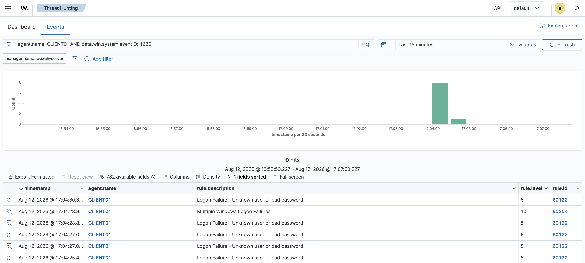
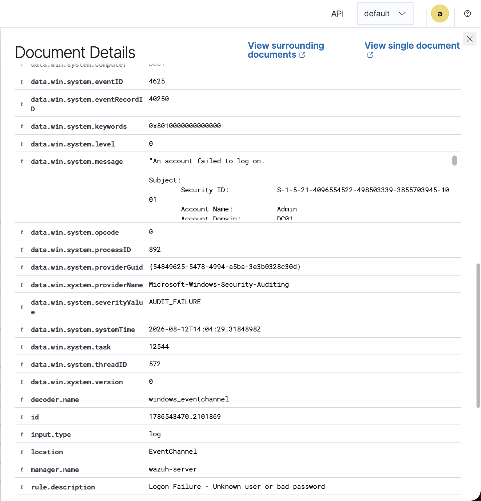
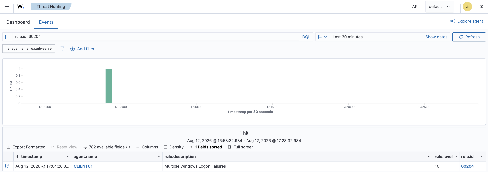

# Project 03 – Authentication Attack Detection

## Overview

This project demonstrates detection and investigation of repeated Windows authentication failures using Wazuh.

A controlled series of failed login attempts was generated against a test account on `CLIENT01`. Windows recorded the failures as Event ID 4625, which were collected and analyzed by Wazuh.

## Detection Flow

```text
Failed Authentication Attempts
        ↓
Windows Event ID 4625
        ↓
Wazuh Agent
        ↓
Wazuh Correlation
        ↓
Rule 60204 – Multiple Login Failures
        ↓
SOC Investigation
```

## Scenario

A dedicated account named `SOC-Test` was created and multiple authentication attempts were performed using incorrect credentials.

Windows auditing captured the failed logons and Wazuh successfully correlated the repeated activity.

## Results

- Windows failed logons successfully captured
- Event ID 4625 observed
- 9 correlated Wazuh hits observed
- Wazuh Rule 60204 triggered
- Multiple login failures successfully identified
- Authentication event details investigated

## Evidence

### Windows Failed Logons


### Wazuh Authentication Events


### Authentication Investigation


### Correlated Detection


## Skills Demonstrated

- Windows Security auditing
- Authentication monitoring
- Wazuh SIEM
- Event ID 4625 analysis
- Alert correlation
- Threat detection
- SOC investigation