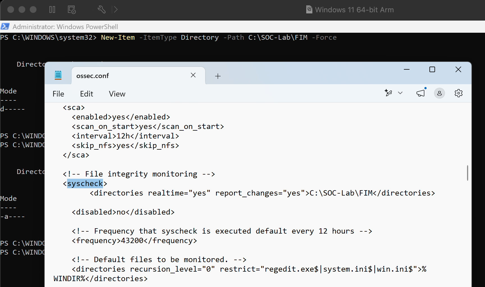
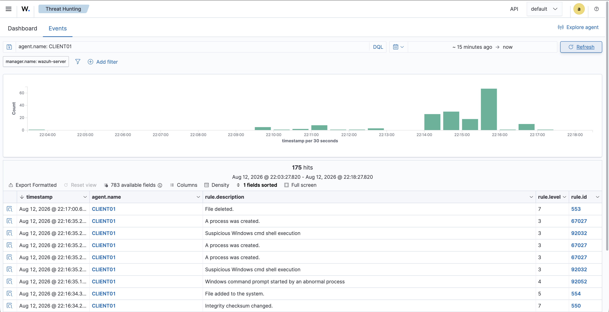
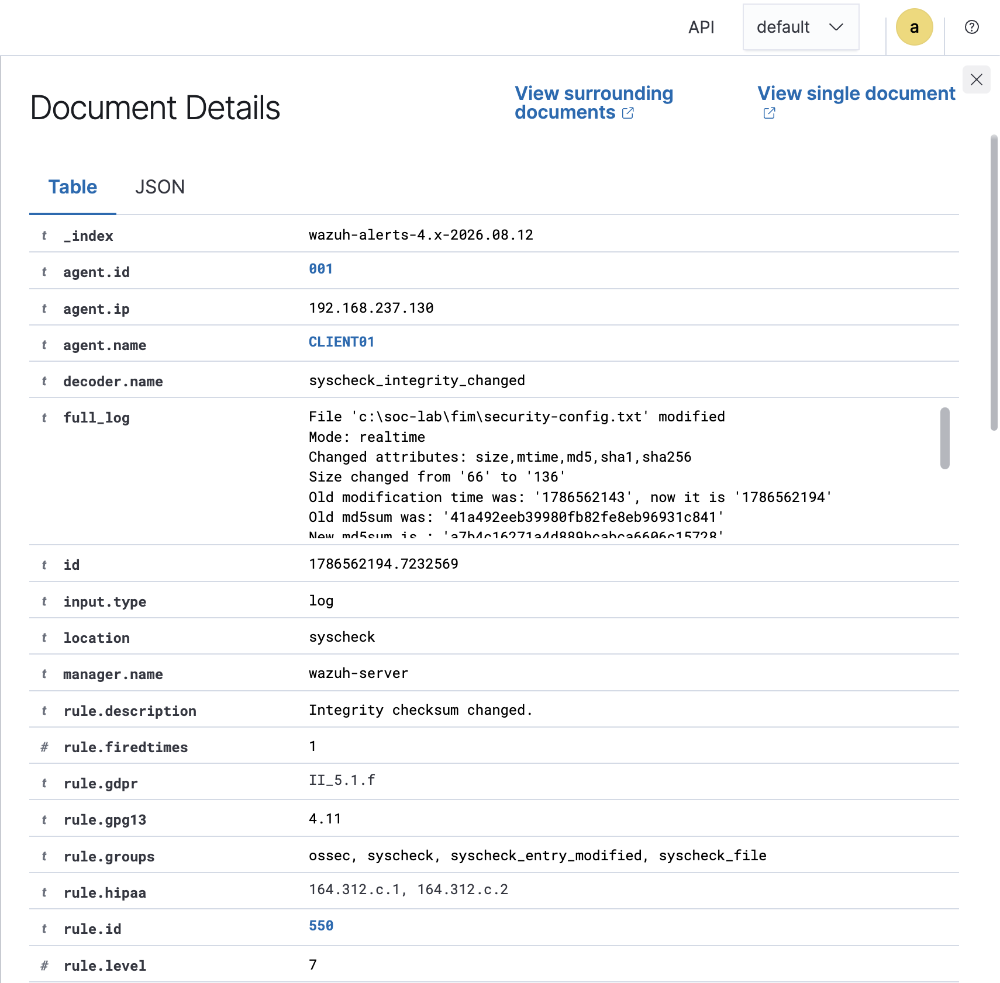

# Project 04 – File Integrity Monitoring

## Overview

This project demonstrates File Integrity Monitoring (FIM) on a Windows endpoint using Wazuh.

A dedicated directory on `CLIENT01` was monitored in real time to detect file creation, modification, and deletion.

## Detection Flow

```text
Windows File Activity
        ↓
Wazuh Agent FIM
        ↓
Integrity Monitoring
        ↓
Wazuh Alerts
        ↓
SOC Investigation
```

## Testing

Controlled file operations were performed inside the monitored directory:

- File creation
- File modification
- File deletion

Wazuh detected all three activities.

## Results

| Rule | Detection |
|---|---|
| 554 | File added to the system |
| 550 | Integrity checksum changed |
| 553 | File deleted |

The file modification generated a Level 7 integrity alert and was investigated through Wazuh Threat Hunting.

## Evidence

### FIM Configuration


### File Changes Detected


### Integrity Investigation


## Skills Demonstrated

- Wazuh FIM
- File integrity monitoring
- Windows endpoint monitoring
- Change detection
- SIEM investigation