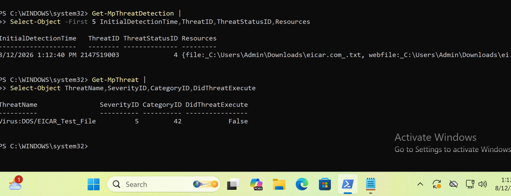
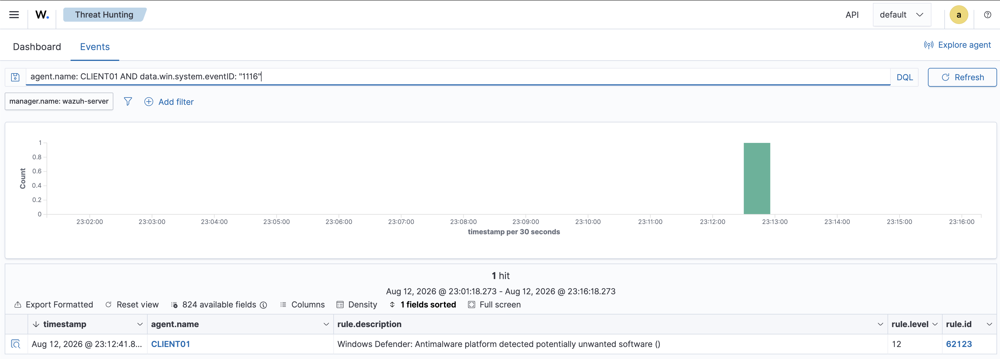
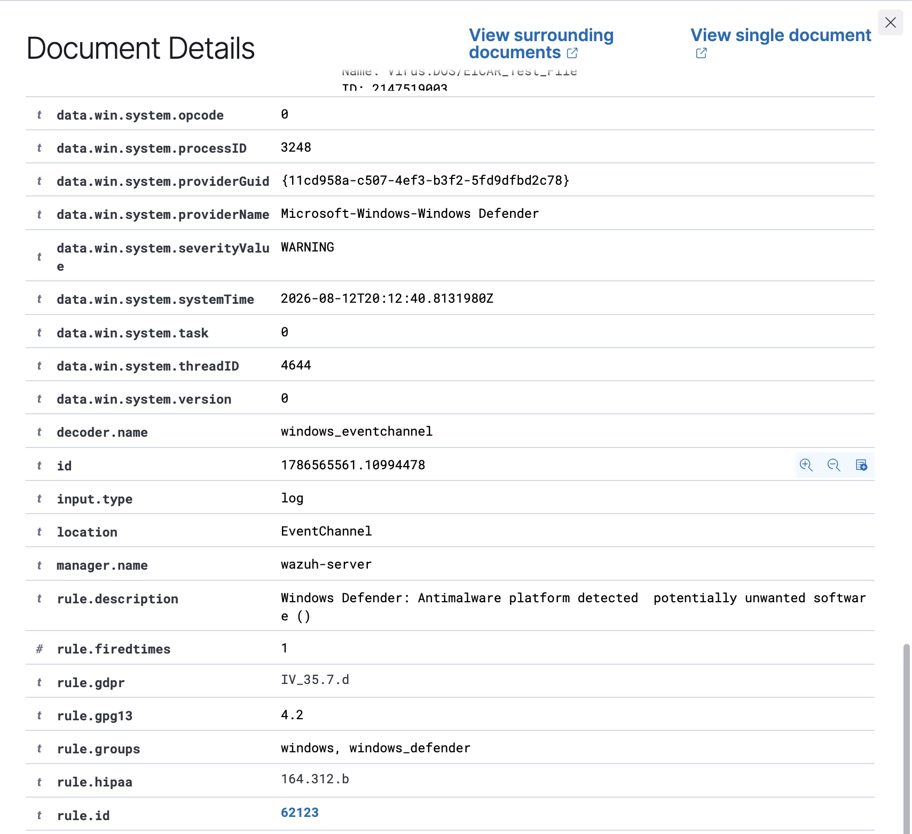

# Project 05 – Malware Detection & Incident Investigation

## Overview

This project demonstrates endpoint malware detection and SOC investigation using Microsoft Defender and Wazuh.

The safe EICAR anti-malware test file was used to trigger a controlled Defender detection on `CLIENT01`.

## Detection Flow

```text
EICAR Test File
      ↓
Microsoft Defender
      ↓
Windows Defender Event 1116
      ↓
Wazuh Agent
      ↓
Wazuh Rule 62123
      ↓
SOC Investigation
```

## Investigation

Microsoft Defender identified the EICAR test artifact and generated Windows Defender Event ID 1116.

The Defender event was collected by the Wazuh agent and surfaced as Wazuh Rule 62123, allowing the detection to be investigated centrally through Wazuh Threat Hunting.

## Results

- EICAR test artifact successfully detected
- Microsoft Defender Event ID 1116 observed
- Defender telemetry successfully ingested by Wazuh
- Wazuh Rule 62123 triggered
- Malware alert investigated on `CLIENT01`

## Evidence

### Defender Detection


### Wazuh Detection


### Alert Investigation


## Skills Demonstrated

- Microsoft Defender
- Wazuh
- Malware alert triage
- Endpoint security monitoring
- Windows Defender telemetry
- SIEM investigation
- Detection validation