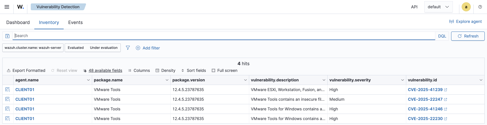
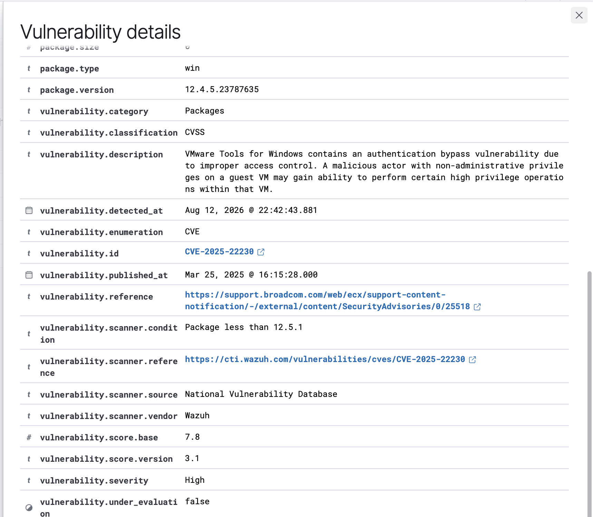
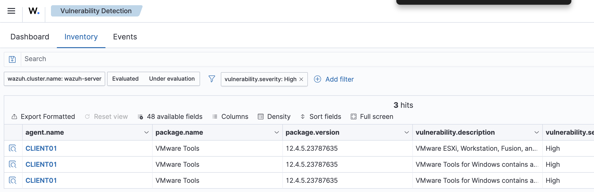
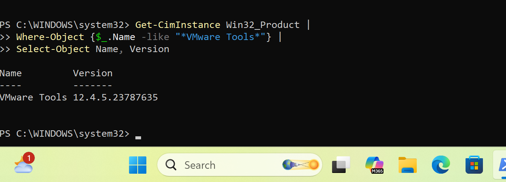

# Project 06 – Vulnerability Detection & Remediation Assessment

## Overview

This project demonstrates vulnerability identification, validation, prioritization, and remediation assessment using Wazuh Vulnerability Detection.

Wazuh identified four vulnerabilities on the Windows endpoint `CLIENT01`, including three High-severity findings associated with VMware Tools.

## Findings

```text
Asset: CLIENT01
VMware Tools: 12.4.5

High:
- CVE-2025-22230
- CVE-2025-41239
- CVE-2025-41246

Medium:
- 1 additional finding
```

## Investigation

The Wazuh findings were validated against the software installed on `CLIENT01`.

VMware Tools version `12.4.5` was confirmed on the endpoint, supporting the vulnerability findings reported by Wazuh.

The three High-severity CVEs were reviewed and a software upgrade was identified as the required remediation.

## Remediation Status

```text
Finding      → Confirmed
Severity     → High
Remediation  → Upgrade VMware Tools
Status       → Open / Remediation Pending
```

The current lab environment did not provide an available VMware Tools or VMware Fusion upgrade path, so the findings were documented for remediation rather than incorrectly marked as resolved.

## Evidence

### Vulnerability Dashboard


### CLIENT01 Vulnerabilities


### CVE Investigation


### Installed Software Validation


## Skills Demonstrated

- Wazuh Vulnerability Detection
- CVE investigation
- Vulnerability validation
- Severity assessment
- Software inventory analysis
- Remediation planning
- Vulnerability tracking