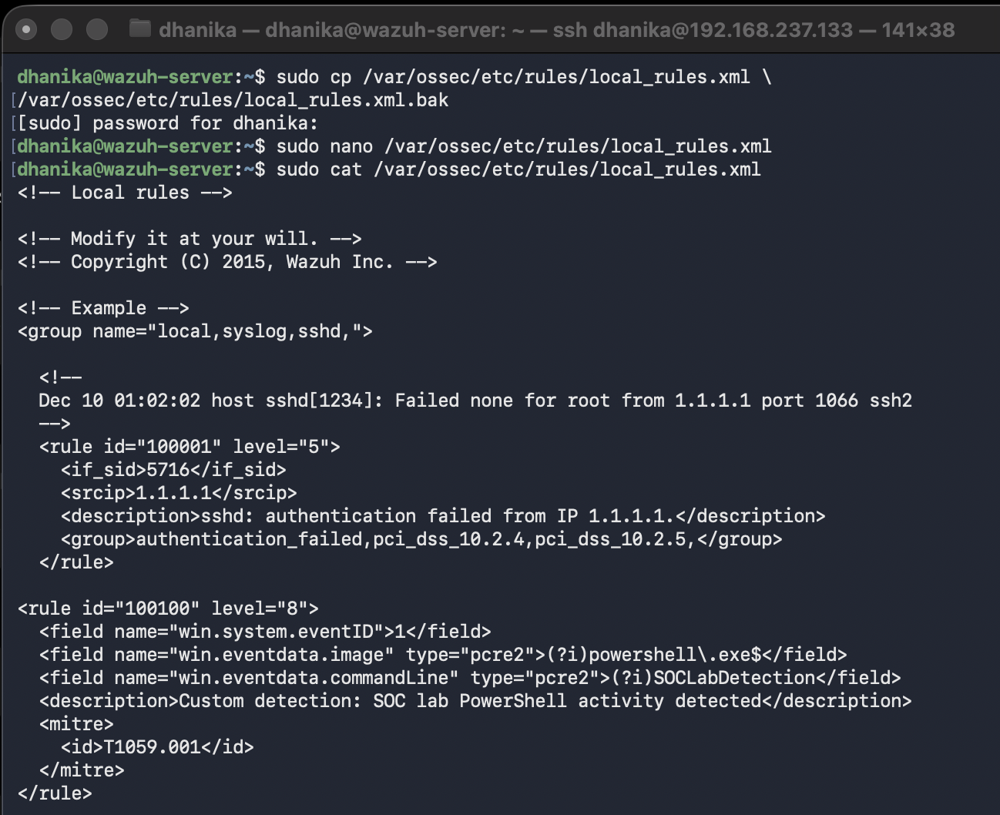
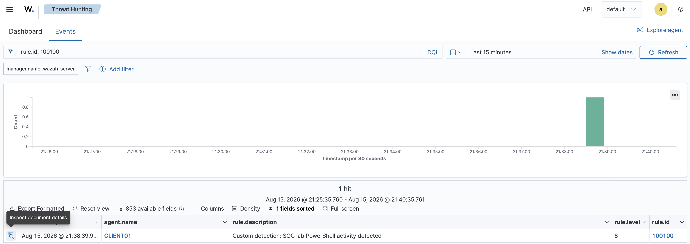
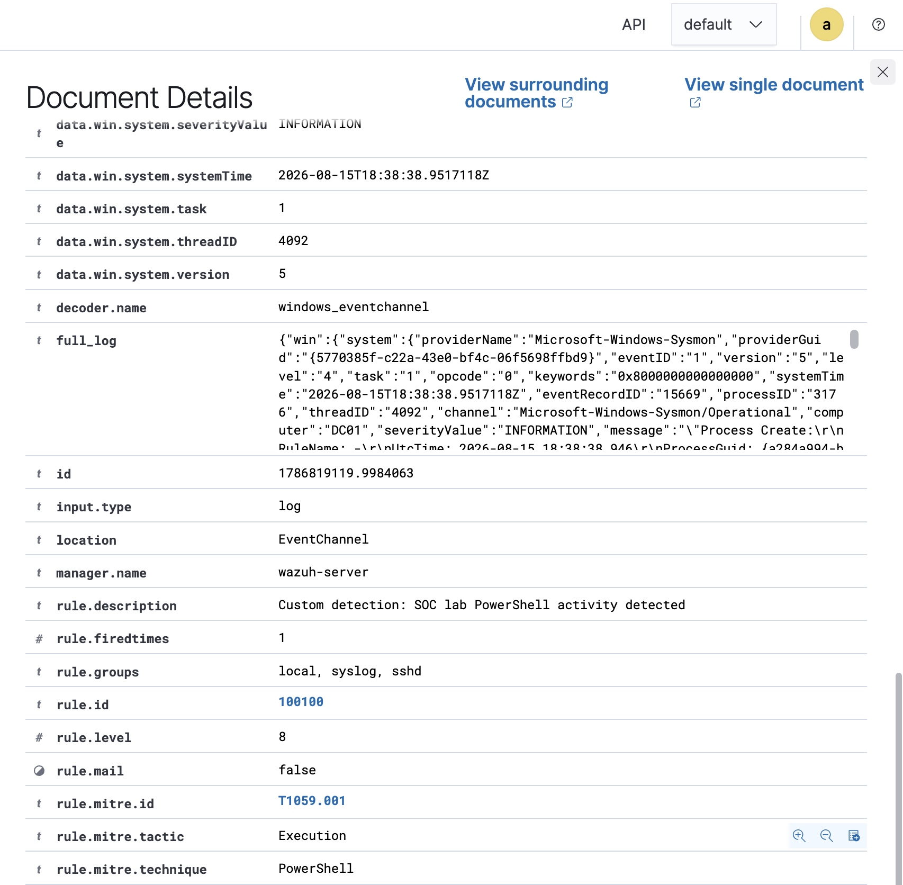
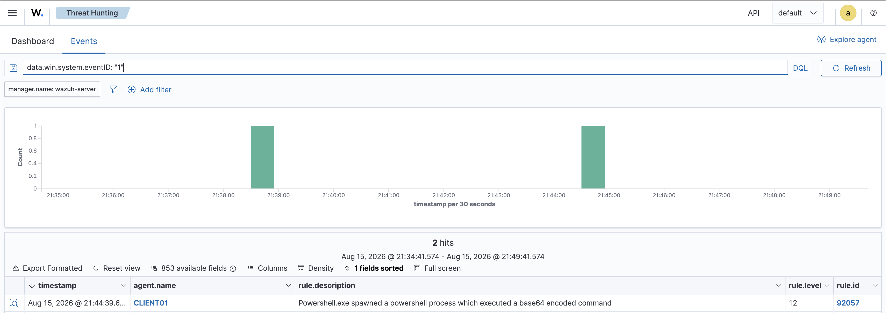

# Project 07 – Custom Detection Rules

## Overview

This project demonstrates custom detection engineering in Wazuh using Windows Sysmon process telemetry.

Two custom Wazuh rules were created and validated against controlled PowerShell activity on a Windows 11 VM.

## Detection Flow

```text
PowerShell Execution
        ↓
Sysmon Event ID 1
        ↓
Wazuh Agent
        ↓
Custom Detection Rule
        ↓
MITRE ATT&CK T1059.001
        ↓
SOC Alert
```

## Custom Detections

| Rule | Level | Detection |
|---|---:|---|
| 100100 | 8 | SOC lab PowerShell activity |
| 100101 | 10 | Encoded PowerShell command execution |

### Rule 100100

Detects a controlled PowerShell command containing the `SOCLabDetection` marker.

### Rule 100101

Detects PowerShell process activity containing `-EncodedCommand` or `-enc`.

The second rule represents a higher-risk detection because encoded PowerShell commands can be used to obscure command content.

## MITRE ATT&CK

Both detections were mapped to:

**T1059.001 – Command and Scripting Interpreter: PowerShell**

## Results

- Sysmon Event ID 1 successfully collected
- Custom Wazuh Rule 100100 triggered
- Encoded PowerShell Rule 100101 triggered
- Rule 100101 assigned Level 10
- MITRE ATT&CK technique mapped
- Custom alerts investigated through Wazuh

## Evidence

### Custom Rule Configuration


### Custom Detection


### Alert Details


### Encoded PowerShell Detection


## Skills Demonstrated

- Wazuh detection engineering
- Custom SIEM rules
- Sysmon process telemetry
- PowerShell monitoring
- Regex-based detection
- MITRE ATT&CK mapping
- Alert validation
- SOC investigation