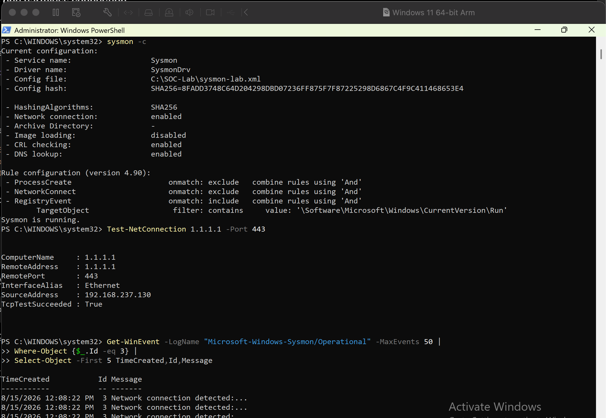
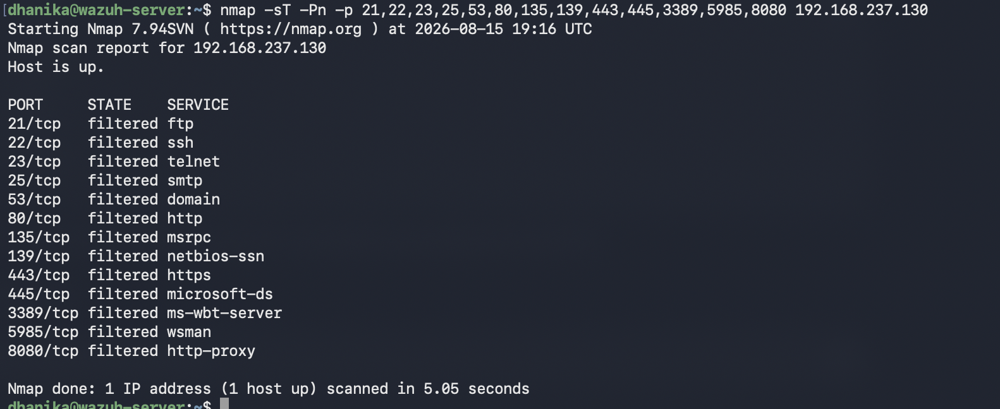
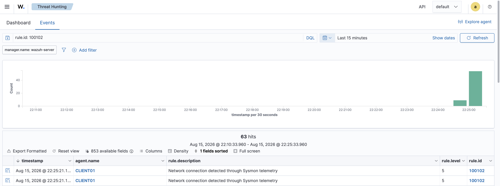
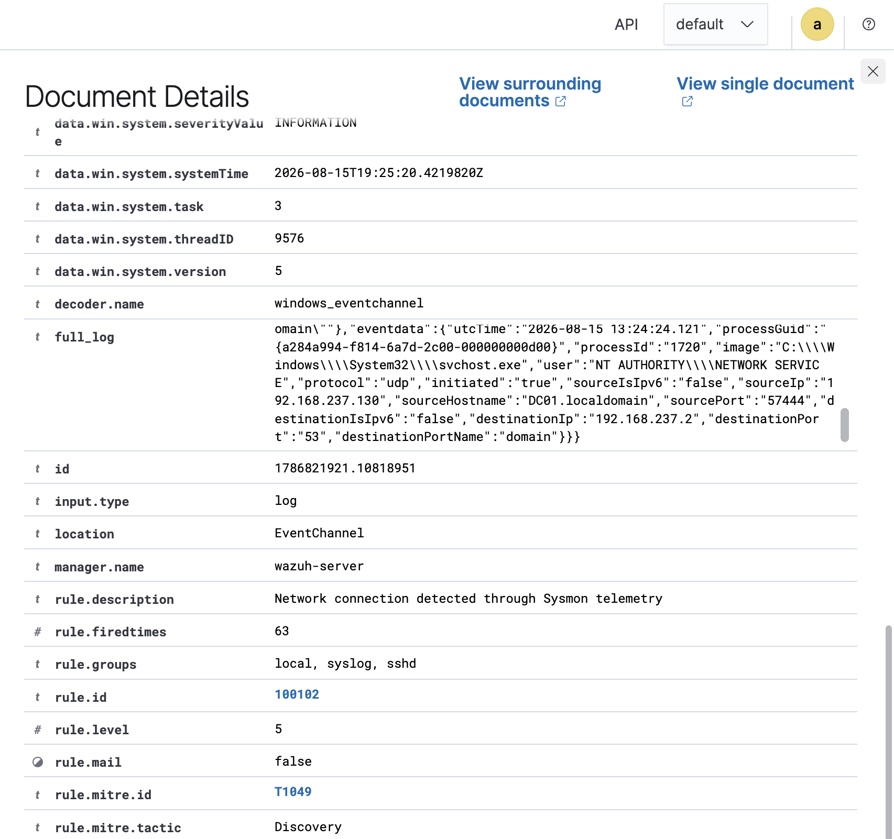

# Project 08 – Network Threat Detection

## Overview

This project demonstrates endpoint network monitoring and threat hunting using Sysmon and Wazuh.

Sysmon Event ID 3 was enabled on a Windows 11 VM to collect network connection telemetry. The events were forwarded to Wazuh and a custom detection rule was created to generate alerts for observed network connections.

## Detection Flow

```text
Network Activity
      ↓
Sysmon Event ID 3
      ↓
Wazuh Agent
      ↓
Custom Rule 100102
      ↓
SOC Investigation
```

## Lab Activities

- Enabled Sysmon network connection monitoring
- Generated controlled network traffic
- Performed limited Nmap reconnaissance in the lab environment
- Validated Sysmon Event ID 3 telemetry
- Forwarded network events to Wazuh
- Created and validated Wazuh Rule 100102
- Investigated network connection context

## Detection

**Wazuh Rule:** 100102  
**Sysmon Event:** Event ID 3 – Network Connection

The investigation included:

- Source IP
- Destination IP
- Source and destination ports
- Protocol
- Process context
- Connection direction

## Result

Sysmon successfully captured endpoint network connections and Wazuh generated custom alerts from the telemetry.

The Nmap activity was used as controlled reconnaissance within the lab. The project does not claim that Rule 100102 itself identifies or correlates a port scan.

## Evidence

### Network Telemetry


### Controlled Reconnaissance


### Sysmon Network Events


### Wazuh Detection


## Skills Demonstrated

- Network security monitoring
- Sysmon Event ID 3 analysis
- Wazuh SIEM
- Network threat hunting
- Nmap
- Endpoint telemetry
- Custom detection rules
- SOC investigation