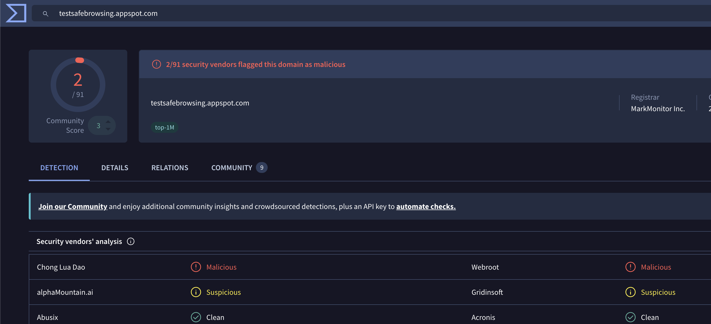
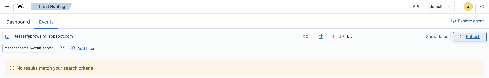
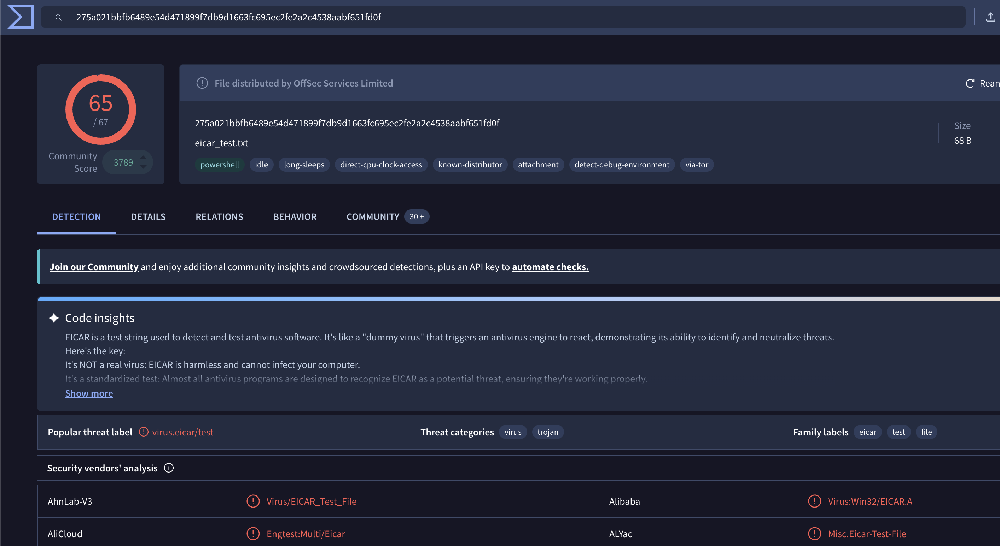
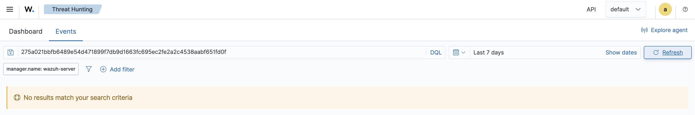

# Project 09 – Threat Intelligence & IOC Investigation

## Overview

This project demonstrates threat-intelligence enrichment and IOC hunting using VirusTotal and Wazuh.

Domain and SHA-256 indicators were enriched using external threat intelligence and searched across internal Wazuh telemetry to determine whether evidence of exposure existed.

## Investigation Flow

```text
IOC Identification
       ↓
VirusTotal Enrichment
       ↓
Reputation Assessment
       ↓
Wazuh IOC Hunt
       ↓
Internal Exposure Analysis
       ↓
Analyst Verdict
```

## Domain Investigation

**IOC:** `testsafebrowsing.appspot.com`  
**Type:** Domain  
**VirusTotal:** 2 security vendor detections  
**Wazuh Hunt:** 0 matches

The domain had external reputation signals, but no matching activity was identified in the monitored Wazuh environment.

## Hash Investigation

**IOC Type:** SHA-256

```text
275a021bbfb6489e54d471899f7db9d1663fc695ec2fe2a2c4538aabf651fd0f
```

**VirusTotal:** 65 security vendor detections  
**Wazuh Hunt:** 0 matches

The hash is associated with the EICAR anti-malware test file and was used only for threat-intelligence lookup and internal IOC hunting.

## Analyst Verdict

External threat-intelligence reputation does not by itself establish compromise.

Neither investigated IOC was found in the Wazuh telemetry searched during the investigation.

**Disposition:** No evidence of internal exposure identified.

## Evidence

### Domain Enrichment


### Domain IOC Hunt


### Hash Enrichment


### Hash IOC Hunt


## Skills Demonstrated

- Threat intelligence
- IOC enrichment
- Domain reputation analysis
- SHA-256 hash investigation
- VirusTotal
- Wazuh threat hunting
- Internal exposure assessment
- SOC investigation and disposition