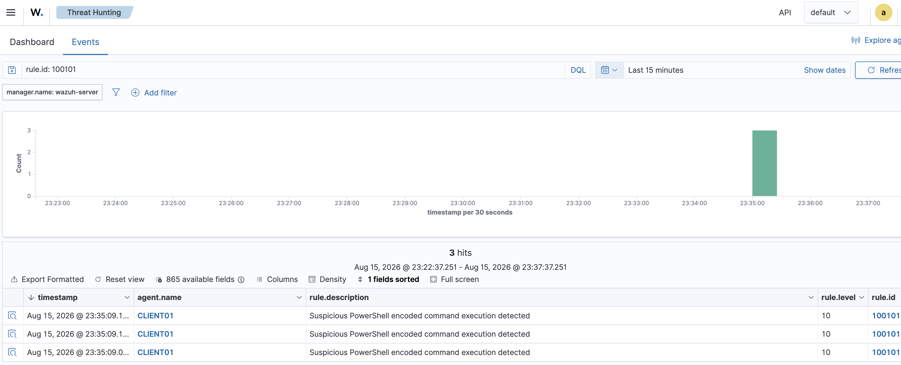
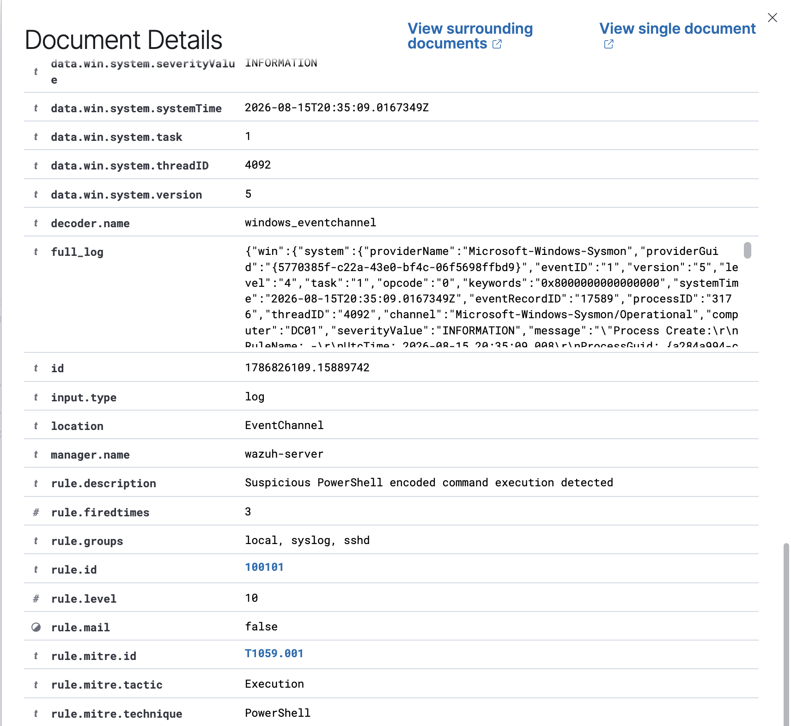
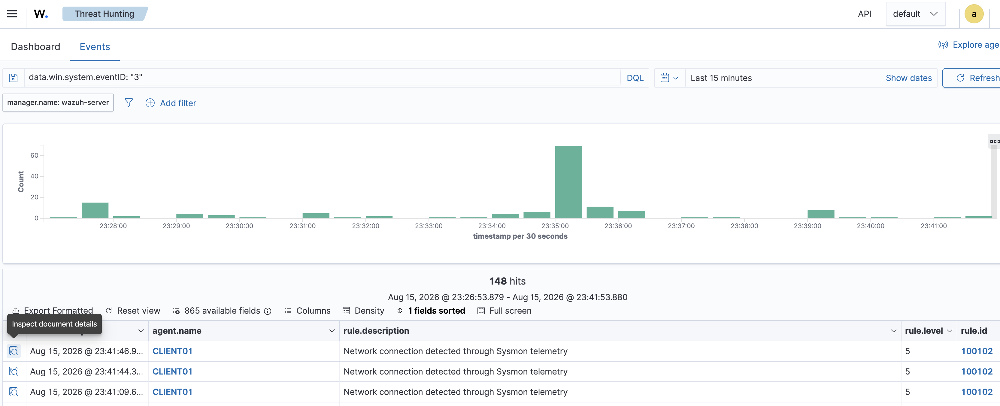
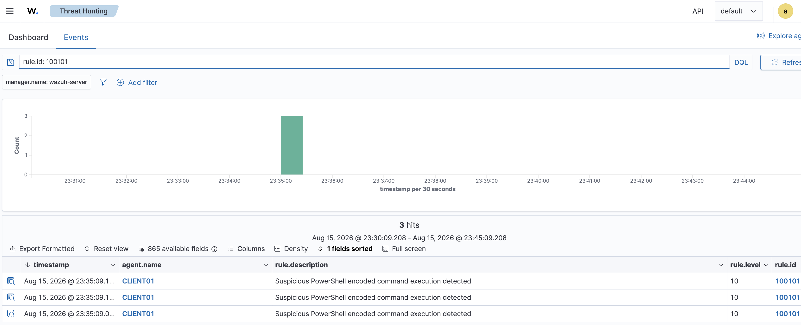
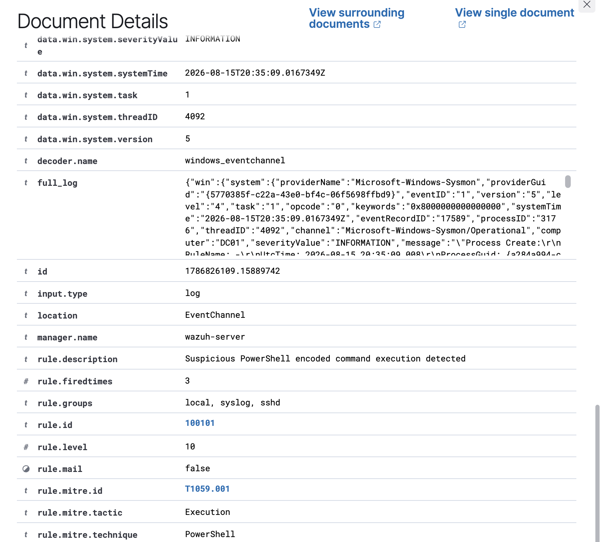

# Project 10 – Incident Investigation & SOC Reporting

## Overview

This capstone project demonstrates an end-to-end SOC investigation using Wazuh and Sysmon.

A controlled encoded PowerShell command generated endpoint telemetry and triggered a custom Wazuh detection. The alert was triaged, process and user context were reviewed, related network activity was hunted, and a final incident disposition was documented.

## Investigation Flow

```text
Encoded PowerShell
        ↓
Sysmon Event ID 1
        ↓
Wazuh Rule 100101
        ↓
SOC Alert Triage
        ↓
Process & User Investigation
        ↓
Network Activity Hunt
        ↓
MITRE ATT&CK Mapping
        ↓
Analyst Assessment
        ↓
Incident Closure
```

## Initial Detection

- Wazuh Rule: 100101
- Rule Level: 10
- Event: Sysmon Event ID 1
- Activity: Encoded PowerShell execution
- MITRE ATT&CK: T1059.001 – PowerShell
- Initial Severity: High

## Investigation

The PowerShell command line contained the `-EncodedCommand` parameter.

The analyst reviewed:

- Process and command-line telemetry
- Parent/process context
- User context
- Endpoint information
- Related Sysmon network telemetry
- Activity surrounding the alert timestamp

No PowerShell-related network connections were identified during the investigated time window, and no evidence of follow-on compromise was found.

## Final Assessment

**Detection:** True Positive  
**Activity:** Authorized / Benign Lab Test  
**Evidence of Compromise:** None identified  
**Network Follow-on:** None identified  
**Final Disposition:** Closed

The alert was a true positive because the detection correctly identified encoded PowerShell execution. Investigation established that the activity was an authorized lab test rather than malicious execution.

## Evidence

### Initial Alert


### Process Evidence


### Network Investigation


### Incident Timeline


### Final Assessment


## Skills Demonstrated

- SOC alert triage
- Wazuh SIEM investigation
- Sysmon telemetry analysis
- PowerShell investigation
- MITRE ATT&CK mapping
- Network threat hunting
- Incident timeline development
- Severity assessment
- Incident classification
- SOC documentation and reporting